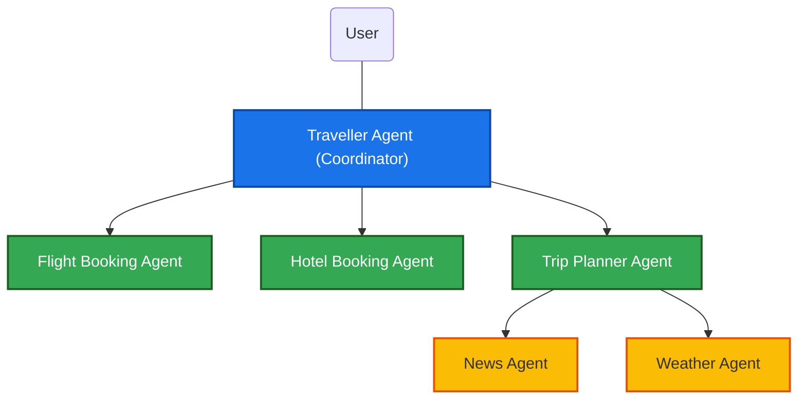
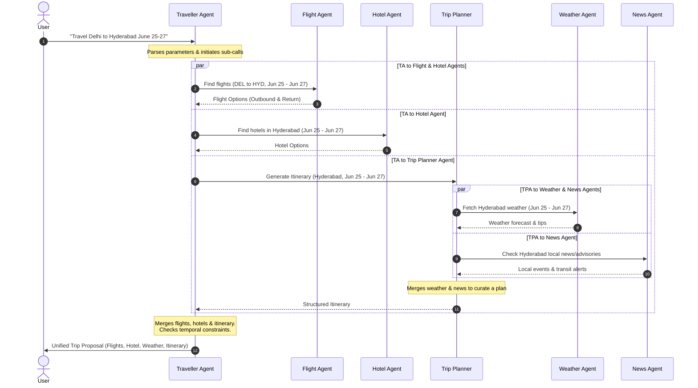

# Traveller Agent System: Architecture & Design

This document details the system architecture, agent topology, data flows, and state management logic for the multi-agent travel coordinator system.

---

## 1. System Architecture Diagram

Below is the conceptual architecture using the **Coordinator Multi-Agent Pattern**. The **Traveller Agent** coordinates the entire flow, delegating specialized duties to leaf agents and aggregating their responses.



---

## 2. Agent Logic & Responsibilities

### A. Traveller Agent (Main Coordinator)
- **Role**: Orchestrator and central point of communication with the user.
- **Responsibilities**:
  1. Parse the user request to extract target parameters: `origin`, `destination`, `start_date`, `end_date`, and any specific constraints (budget, preferences).
  2. Spawn tasks for the **Flight Booking Agent**, **Hotel Booking Agent**, and **Trip Planner Agent** in parallel.
  3. Aggregate intermediate outputs, resolve dependencies (e.g., flight arrival times must align with hotel check-in), and synthesize a unified travel plan.
  4. Prompt the user for approval or modifications.
- **State Schema**:
  ```json
  {
    "user_request": {
      "origin": "Delhi (DEL)",
      "destination": "Hyderabad (HYD)",
      "start_date": "2026-06-25",
      "end_date": "2026-06-27"
    },
    "flights": null,
    "hotel": null,
    "itinerary": null,
    "system_status": "PENDING"
  }
  ```

### B. Flight Booking Agent
- **Role**: Specialized service locator and flight scheduler.
- **Responsibilities**:
  1. Retrieve potential flight matches for the given route (`DEL` <-> `HYD`) and dates (June 25 and June 27).
  2. Filter flights based on optimal departure times, duration, and price points.
  3. Return a list of candidate flights to the coordinator.
- **Inputs**: `origin`, `destination`, `departure_date`, `return_date`.
- **Outputs**: Detailed JSON list of outbound and inbound flight options.

### C. Hotel Booking Agent
- **Role**: Accommodation finder.
- **Responsibilities**:
  1. Look up lodging options in the destination city (`Hyderabad`) checking in on June 25 and checking out on June 27.
  2. Filter based on rating, distance to key areas, and price range.
  3. Return candidate options to the coordinator.
- **Inputs**: `destination`, `check_in_date`, `check_out_date`.
- **Outputs**: Structured list of hotel candidates.

### D. Trip Planner Agent
- **Role**: Coordinator for activities, itinerary generation, and local context gathering.
- **Responsibilities**:
  1. Coordinate internal sub-agents: **Weather Agent** and **News Agent** for the destination.
  2. Aggregate local conditions (weather forecast, active alerts, local news) to tailor an itinerary.
  3. Select attractions, landmarks, and restaurants, and order them logically based on the weather forecast.
- **Inputs**: `destination`, `start_date`, `end_date`.
- **Outputs**: Personalized itinerary and regional details.

#### Internal Sub-agents under Trip Planner:
* **Weather Agent**:
  - *Role*: Fetches local weather forecast for June 25 to June 27 in Hyderabad.
  - *Outputs*: Temperature ranges, rain probability, and advice (e.g., "Carry umbrella," "Outdoor activities recommended on day 2").
* **News Agent**:
  - *Role*: Checks current local events, news, or travel advisories for Hyderabad.
  - *Outputs*: Safety notices, high-profile festivals, transit updates, or events to attend.

---

## 3. Communication and Data Flow Sequence

The sequential interaction between agents is illustrated in the diagram below:



---

## 4. Setup & Running the Project

This project uses `uv` for package management and Python virtual environments.

### Prerequisites
- Python `\ge 3.12`
- [uv](https://github.com/astral-sh/uv) package manager

### Configuration
Create a `.env` file in the root directory and add your API credentials:
```env
GROQ_API_KEY=your_groq_api_key
```

### Running the System
You can execute the multi-agent travel coordinator with a default or custom prompt using `uv run`:

```bash
# Run with the default Delhi -> Hyderabad trip query
uv run python -m src.agents.graph

# Run with a custom query
uv run python -m src.agents.graph "Travel from Mumbai to Goa from July 10 to July 15, 2026."
```
