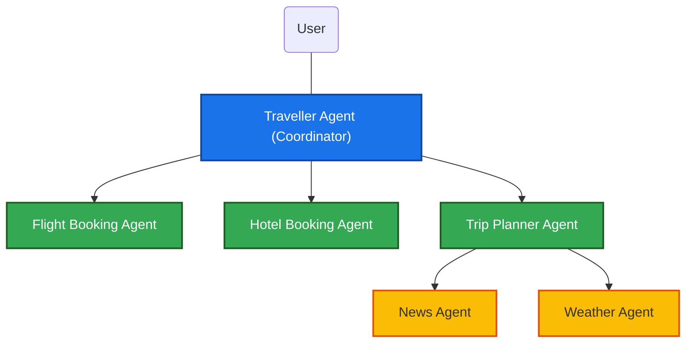
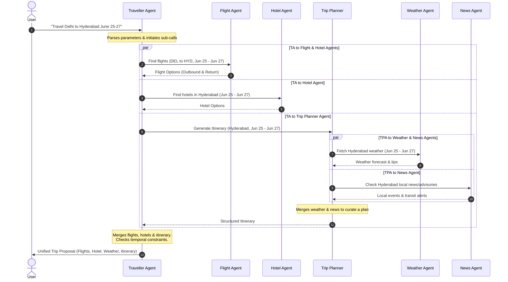

# Traveller Agent System: Architecture & Design

This document details the system architecture, agent topology, data flows, and state management logic for the multi-agent travel coordinator system.

---

## 1. System Architecture Diagram

Below is the conceptual architecture using the **Coordinator Multi-Agent Pattern**. The **Traveller Agent** coordinates the entire flow, delegating specialized duties to leaf agents and aggregating their responses.



---

## 2. Agent Logic & Responsibilities

### A. Traveller Agent (Main Coordinator)
- **Role**: Orchestrator and central point of communication with the user.
- **Responsibilities**:
  1. Parse the user request to extract target parameters: `origin`, `destination`, `start_date`, `end_date`, and any specific constraints (budget, preferences).
  2. Spawn tasks for the **Flight Booking Agent**, **Hotel Booking Agent**, and **Trip Planner Agent** in parallel.
  3. Aggregate intermediate outputs, resolve dependencies (e.g., flight arrival times must align with hotel check-in), and synthesize a unified travel plan.
  4. Prompt the user for approval or modifications.
- **State Schema**:
  ```json
  {
    "user_request": {
      "origin": "Delhi (DEL)",
      "destination": "Hyderabad (HYD)",
      "start_date": "2026-06-25",
      "end_date": "2026-06-27"
    },
    "flights": null,
    "hotel": null,
    "itinerary": null,
    "system_status": "PENDING"
  }
  ```

### B. Flight Booking Agent
- **Role**: Specialized service locator and flight scheduler.
- **Responsibilities**:
  1. Retrieve potential flight matches for the given route (`DEL` <-> `HYD`) and dates (June 25 and June 27).
  2. Filter flights based on optimal departure times, duration, and price points.
  3. Return a list of candidate flights to the coordinator.
- **Inputs**: `origin`, `destination`, `departure_date`, `return_date`.
- **Outputs**: Detailed JSON list of outbound and inbound flight options.

### C. Hotel Booking Agent
- **Role**: Accommodation finder.
- **Responsibilities**:
  1. Look up lodging options in the destination city (`Hyderabad`) checking in on June 25 and checking out on June 27.
  2. Filter based on rating, distance to key areas, and price range.
  3. Return candidate options to the coordinator.
- **Inputs**: `destination`, `check_in_date`, `check_out_date`.
- **Outputs**: Structured list of hotel candidates.

### D. Trip Planner Agent
- **Role**: Coordinator for activities, itinerary generation, and local context gathering.
- **Responsibilities**:
  1. Coordinate internal sub-agents: **Weather Agent** and **News Agent** for the destination.
  2. Aggregate local conditions (weather forecast, active alerts, local news) to tailor an itinerary.
  3. Select attractions, landmarks, and restaurants, and order them logically based on the weather forecast.
- **Inputs**: `destination`, `start_date`, `end_date`.
- **Outputs**: Personalized itinerary and regional details.

#### Internal Sub-agents under Trip Planner:
* **Weather Agent**:
  - *Role*: Fetches local weather forecast for June 25 to June 27 in Hyderabad.
  - *Outputs*: Temperature ranges, rain probability, and advice (e.g., "Carry umbrella," "Outdoor activities recommended on day 2").
* **News Agent**:
  - *Role*: Checks current local events, news, or travel advisories for Hyderabad.
  - *Outputs*: Safety notices, high-profile festivals, transit updates, or events to attend.

---

## 3. Communication and Data Flow Sequence

The sequential interaction between agents is illustrated in the diagram below:



---

## 4. Setup & Running the Project

This project uses `uv` for package management and Python virtual environments.

### Prerequisites
- Python `\ge 3.12`
- [uv](https://github.com/astral-sh/uv) package manager

### Configuration
Create a `.env` file in the root directory and add your API credentials:
```env
GROQ_API_KEY=your_groq_api_key
```

### Running the System
You can execute the multi-agent travel coordinator with a default or custom prompt using `uv run`:

```bash
# Run with the default Delhi -> Hyderabad trip query
uv run python -m src.agents.graph

# Run with a custom query
uv run python -m src.agents.graph "Travel from Mumbai to Goa from July 10 to July 15, 2026."
```

### Sample Execution Output

<details>
<summary><b>Click to expand sample output for:</b> <i>"Travel from Delhi to Hyderabad from June 25 to June 27, 2026."</i></summary>

```markdown
=== Starting Travel Planner Coordinator ===
User Query: Travel from Delhi to Hyderabad from June 25 to June 27, 2026.


=== Final Traveller Agent Proposal ===

## ✈️ Premium Hyderabad Getaway  
**Travel dates:** 25 Jun 2026 – 27 Jun 2026  
**Origin – Destination:** Delhi (DEL) → Hyderabad (HYD)  

---

### 1️⃣ Recommended Flights  *(IndiGo – best value & convenience)*  

| Leg | Airline | Flight | Departs (IST) | Arrives (IST) | Price (₹) |
|-----|---------|--------|---------------|---------------|-----------|
| **Outbound** | **IndiGo** | 6E-502 | 13:30 – 15:45 | 15:45 | **₹4,200** |
| **Inbound** | **IndiGo** | 6E-503 | 16:45 – 19:00 | 19:00 | **₹4,100** |
| **Total Round-Trip** | | | | | **₹8,300** |

*Why this combo?*  
- **Lowest combined fare** (≈ ₹1,300 cheaper than the next best pair).  
- **Mid-day outbound** avoids early-morning rush; **early-evening inbound** gives you a full day in Hyderabad on the 27th.  
- Same carrier → single booking reference, smoother check-in & baggage handling.  

*Alternative* – If you prefer an early-morning departure, consider Air India AI-101 (07:00 – 09:15, ₹4,500) paired with the IndiGo inbound for a total of **₹8,600**.

---

### 2️⃣ Hand-picked Hotels (one per night – premium experience)

| Night | Hotel | Rating | Approx. Price / Night (₹) | Area / Location | Why it fits the itinerary |
|-------|-------|--------|---------------------------|-----------------|---------------------------|
| **25 Jun** | **Taj Falaknuma Palace** | 5 ★ (luxury heritage) | **25,000** | Falaknuma (south-central) | Royal ambience mirrors the historic Old-City vibe; private garden & pool for a cool afternoon retreat after the Charminar walk. |
| **26 Jun** | **ITC Kohenur** | 5 ★ (boutique luxury) | **15,000** | Madhapur (IT corridor) | Central location, excellent indoor facilities (spa, multiple restaurants) – perfect for a rain-smart day of Golconda Fort, spa, and evening festival. |
| **27 Jun** | **Lemon Tree Premier – Hyderabad Airport** | 4 ★ (airport-side comfort) | **6,000** | Near Rajiv Gandhi International Airport | Quick check-out and easy transfer to your 19:00 flight; fresh rooms for a relaxed final night. |

**Total accommodation cost (2 nights):** **₹46,000**  
*(All rates are approximate per night, based on standard room + breakfast. Taxes & service charges may apply.)*

---

### 3️⃣ Weather Forecast & Local Advisories (June 25-27, 2026)

| Date | Forecast (mid-day) | High / Low (°C) | Rain % | Advisory |
|------|-------------------|----------------|--------|----------|
| **25 Jun (Fri)** | Partly-cloudy, sunny intervals | 36 / 28 | 20 % | Light cotton clothing, sun-hat & sunglasses; stay hydrated. |
| **26 Jun (Sat)** | Scattered showers, occasional thunderstorms | 33 / 26 | 60 % | Carry a compact umbrella or rain-coat; plan outdoor activities early, shift indoors after 11 am. |
| **27 Jun (Sun)** | Sunny, clear skies | 37 / 29 | 10 % | Sunscreen (SPF 30+), hat, and light breathable fabrics. |

**Local Event:** *Food & Haleem Festival* (Charminar area) – open 10 am – 10 pm both days, with live music performances 6 pm – 9 pm on the 25th & 26th.

---

### 4️⃣ Day-by-Day Itinerary (weather-aware, premium experience)

#### **Day 1 – Friday, 25 Jun**  
*Theme: Historic Hyderabad & culinary immersion*  

| Time (IST) | Activity | Details |
|------------|----------|---------|
| **07:30 – 08:30** | Arrival & early check-in | Taj Falaknuma Palace (private car from RGA, 20 min). |
| **08:30 – 09:30** | Royal breakfast | Buffet featuring Hyderabadi specialties (biryani, keema). |
| **09:30 – 10:00** | Transfer to Old City | Hotel car; traffic light early morning. |
| **10:00 – 12:00** | Charminar & Mecca Masjid tour | Guided walk, optional minaret climb (bring a light scarf). |
| **12:00 – 13:30** | Lunch at Food & Haleem Festival | Sample authentic Haleem, kebabs, and sweets. |
| **13:30 – 14:00** | Refresh with a glass of chaas (buttermilk) | Street-side stall, stay cool. |
| **14:00 – 16:30** | Salar Jung Museum (indoor) | World-class art collection, AC-cooled. |
| **16:30 – 17:30** | Return to hotel – freshen up | |
| **17:30 – 19:30** | Sunset boat ride on Hussain Sagar & Buddha Statue | Light breeze; bring a light shawl. |
| **20:00 – 22:00** | Dinner at “Altitude” (ITC Kohenur) – rooftop Indian-fusion | Smart-casual dress; reservation required. |
| **22:30** | Nightcap at palace lounge (Bar-Mitzvah) | Relax in the historic setting. |

#### **Day 2 – Saturday, 26 Jun**  
*Theme: Rain-smart culture & luxury relaxation*  

| Time (IST) | Activity | Details |
|------------|----------|---------|
| **07:00 – 08:00** | Breakfast (continental + chai) | ITC Kohenur lounge. |
| **08:00 – 09:00** | Transfer to Golconda Fort (early to beat showers) | Private car, water-resistant shoes. |
| **09:30 – 11:30** | Guided Golconda Fort tour (ramparts, acoustics) | Umbrella/poncho on standby. |
| **11:30 – 12:00** | Return to hotel – quick refresh | |
| **12:30 – 14:00** | Lunch at ITC Kohenur buffet | Includes Hyderabadi biryani, vegetarian thali. |
| **14:00 – 15:30** | Spa & Wellness – “Royal Hyderabadi Massage” | Heated rooms keep you warm. |
| **15:30 – 16:30** | Coffee & Irani chai at hotel lounge | Light snack before heading out. |
| **16:30 – 18:30** | Shilparamam Crafts Village (covered galleries) | Metro Blue Line (Hitec City → Shilparamam). |
| **18:30 – 19:30** | Early dinner at “Bawarchi” (famous Haleem) | Indoor seating, perfect if rain intensifies. |
| **20:00 – 22:00** | Food & Haleem Festival – evening cultural program | Live folk music & dance; umbrella for walk back; Metro to Lakdi Ka Pul (extended hours). |
| **22:30** | Return to ITC Kohenur – night lounge or private movie screening | Light sweater for 26 °C night. |

#### **Day 3 – Sunday, 27 Jun** *(Departure day – optional light activities)*  

| Time (IST) | Activity | Details |
|------------|----------|---------|
| **07:30 – 08:30** | Breakfast (continental) | Lemon Tree Premier – Hyderabad Airport (or hotel if you stay another night). |
| **09:00 – 10:30** | Visit Birla Mandir (temple on hill) | Panoramic city view; short taxi ride. |
| **11:00 – 12:30** | Shopping at Shoppers Stop, Banjara Hills | Air-conditioned mall – pick up souvenirs. |
| **13:00 – 14:00** | Light lunch – “Andhra Bhojan” thali | Hotel restaurant or nearby café. |
| **15:00** | Check-out & transfer to RGA | Pre-booked airport shuttle (30 min drive). |
| **Evening** | Flight home (IndiGo 6E-503, 16:45 – 19:00) | Keep rain-coat handy for any late-evening showers. |

---

### 5️⃣ Summary of Costs (approx.)

| Item | Cost (₹) |
|------|----------|
| **Round-trip flights (IndiGo)** | **8,300** |
| **Accommodation (3 nights)** | **46,000** |
| **Estimated meals & activities** (incl. festival, spa, entry fees) | **≈ 12,000** |
| **Transfers & local transport** | **≈ 4,000** |
| **Total estimated package** | **≈ 70,300** |

*All figures are indicative; final pricing will be confirmed at booking.*

---

## 📌 Next Steps  

1. **Confirm flight selection** – Shall I lock in the IndiGo 6E-502 / 6E-503 combo?  
2. **Choose your hotel nights** – Preferred combination (Falaknuma → ITC Kohenur → Lemon Tree) or any adjustments.  
3. **Any special requests?** (e.g., vegetarian-only meals, airport lounge access, private city tour guide).  

Once you give the go-ahead, I’ll finalize the bookings, send you the e-tickets, hotel confirmations, and a detailed travel-day PDF with maps, contact numbers, and QR-codes for metro tickets.

**Looking forward to curating an unforgettable Hyderabad experience!** 🚀
```
</details>

